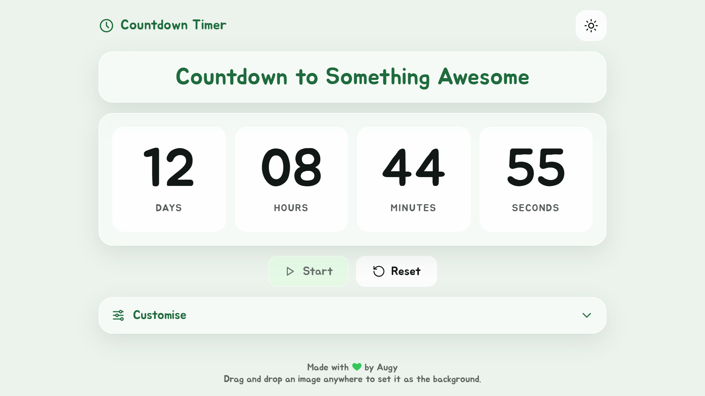

# Countdown Timer

Count down to any date, or for any length of time. Give it a title and a
background, then leave it running, even offline.

Live at **[countdown.uwuapps.org](https://countdown.uwuapps.org/)**. Part of
UwU Apps by Augy Studios.



## Features

- Count down to a date and time, or for a duration in minutes, with an
  optional start delay
- Pause and resume a duration countdown
- Custom title, and an optional background image from a URL, an upload, or
  drag and drop, with dim and blur
- Show or hide days, hours, minutes and seconds; a hidden unit rolls into the
  next one down
- Confetti when time is up, skipped when reduced motion is on
- Installable PWA that works offline, with a bar that offers new versions
  instead of reloading on its own
- Light, dark or time-based mode (light from 09:00 to 18:00), and seven
  brand colours

## Repository layout

| Path | What it is |
|---|---|
| [`main-site/`](main-site/) | The site itself, deployed as-is. See its [README](main-site/README.md). |
| [`uwuapps-theme.md`](uwuapps-theme.md) | The UwU Apps theme system spec: tokens, rules, and the theme modal. |
| [`uwuapps-retrofit-time-mode.md`](uwuapps-retrofit-time-mode.md) | How to add time-based mode to an app on that theme system. |
| [`update-bar-spec.md`](update-bar-spec.md) | The service worker update bar spec. |

The three spec files are shared across UwU Apps projects. Change the site to
match them, not the other way round.

## Quick start

```sh
npx serve main-site
```

Then open the `localhost` URL it prints. More detail, including deploying and
releasing, is in [`main-site/README.md`](main-site/README.md).

## Contributing

Please read the [Code of Conduct](CODE_OF_CONDUCT.md) first.

## License

[MIT](LICENSE), copyright 2026 Augy Studios.
