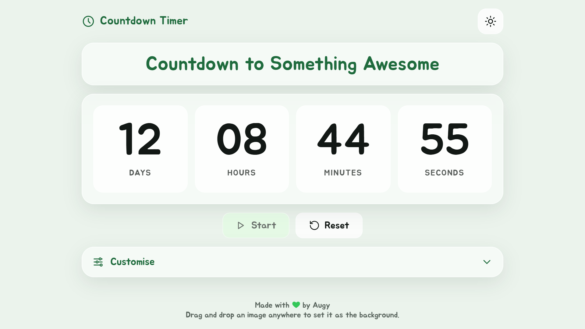

# Countdown Timer

Count down to any date, or for any length of time. Give it a title and a
background, then leave it running, even offline.

Live at **[countdown.uwuapps.org](https://countdown.uwuapps.org/)**. Part of
UwU Apps by Augy Studios.



## Features

- Count down to a date and time, or for a duration in minutes, with an
  optional start delay
- Pause and resume a duration countdown
- Custom title, and an optional background image from a URL, an upload, or
  drag and drop, with dim and blur
- Show or hide days, hours, minutes and seconds; a hidden unit rolls into the
  next one down
- Confetti when time is up, skipped when reduced motion is on
- Present full screen with the play button at the top: the title and clock,
  large, over your background, with the screen kept awake
- Show it on another screen on the same wifi, such as a TV browser or a
  laptop on a projector. The other screen waits until you press play.
  **Mirror** puts the countdown on both screens; **Extend** puts it on the
  other screen and turns yours into a remote with Start, Pause and Reset
- Installable PWA that works offline, with a bar that offers new versions
  instead of reloading on its own
- Light, dark or time-based mode (light from 09:00 to 18:00), and seven
  brand colours

## Repository layout

| Path | What it is |
|---|---|
| [`main-site/`](main-site/) | The site itself, deployed as-is. See its [README](main-site/README.md). |
| [`uwuapps-theme.md`](uwuapps-theme.md) | The UwU Apps theme system spec: tokens, rules, and the theme modal. |
| [`uwuapps-retrofit-time-mode.md`](uwuapps-retrofit-time-mode.md) | How to add time-based mode to an app on that theme system. |
| [`update-bar-spec.md`](update-bar-spec.md) | The service worker update bar spec. |
| [`STUN-p2p-spec.md`](STUN-p2p-spec.md) | Peer-to-peer pairing for screen sharing: STUN only, no TURN relay, no backend. |

The four spec files are shared across UwU Apps projects. Change the site to
match them, not the other way round.

## Sharing and your network

Both devices need to be on the same wifi, or one sharing a hotspot that the
other has joined. Guest, hotel, university and office wifi often blocks
devices from reaching each other; the hotspot is the fix.

The countdown goes straight from one device to the other over an encrypted
connection. To find each other, the two devices briefly use a free public
introduction service (PeerJS) and a public address lookup (STUN, from Google
and Cloudflare). Those see the devices' IP addresses and the share code, never
the countdown. The other device also learns your public IP address. Nothing is
sent until you press play: then the title, the time left and the background
go across. A background set by URL is sent as the URL, so the other screen
loads it from that site itself.

## Quick start

```sh
npx serve main-site
```

Then open the `localhost` URL it prints. More detail, including deploying and
releasing, is in [`main-site/README.md`](main-site/README.md).

## Contributing

Please read the [Code of Conduct](CODE_OF_CONDUCT.md) first.

## License

[MIT](LICENSE), copyright 2026 Augy Studios.
